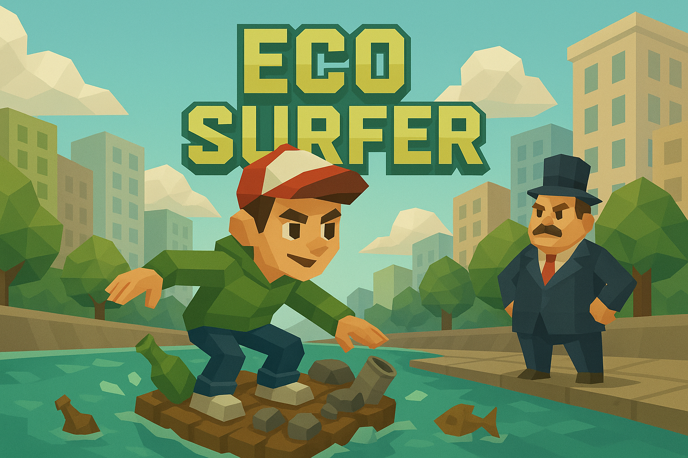

# 🌱 EcoSurfer - Game Edukasi Pengelolaan Sampah



## 📖 Tentang Game

**EcoSurfer** adalah game edukasi Unity yang dirancang untuk memberikan pelajaran penting tentang pentingnya membuang sampah dengan benar dan cara memilah sampah yang baik dan benar. Game ini mengajarkan pemain tentang pengelolaan sampah yang bertanggung jawab melalui pengalaman bermain yang menyenangkan dan interaktif.

## 🎮 Cerita Game

### Latar Belakang
Kota Malang menghadapi masalah serius dengan sampah yang menumpuk di mana-mana. Masyarakat tidak peduli terhadap lingkungan mereka sendiri, dan sampah berserakan di seluruh kota. Pak Walikota hampir putus asa melihat kondisi kota yang semakin memburuk.

### Karakter Utama
- **Pak Walikota**: Pemimpin kota yang frustasi karena masyarakat tidak peduli terhadap lingkungan
- **Adib**: Sosok yang dipercaya oleh Pak Walikota untuk menjadi pionir dalam memotivasi masyarakat

### Misi
Adib ditugaskan oleh Pak Walikota untuk menjadi pionir yang memotivasi orang-orang agar mau berlomba membersihkan sampah dan dapat memilah sampah yang benar. Melalui perjalanan Adib, pemain akan belajar tentang pentingnya pengelolaan sampah yang bertanggung jawab.

## 🎯 Tujuan Edukasi

Game ini bertujuan untuk:
- Mengajarkan pentingnya membuang sampah dengan benar
- Memberikan pemahaman tentang cara memilah sampah yang baik dan benar
- Meningkatkan kesadaran masyarakat tentang pengelolaan sampah
- Memotivasi pemain untuk menjadi agen perubahan dalam kebersihan lingkungan

## 🎮 Gameplay Mechanics

### Sistem Pemilah Sampah
Game ini mengajarkan pemain untuk memilah sampah ke dalam 3 kategori utama:

1. **Organik** 🥬
   - Sampah yang dapat terurai secara alami
   - Contoh: sisa makanan, daun-daunan

2. **Anorganik** 🥤
   - Sampah yang tidak dapat terurai secara alami
   - Contoh: botol plastik, kaleng, kertas

3. **B3 (Bahan Berbahaya dan Beracun)** ⚠️
   - Sampah yang berbahaya bagi lingkungan
   - Contoh: baterai, obat-obatan, bahan kimia

### Fitur Gameplay

#### 🏃‍♂️ Karakter Kontrol
- **Player Movement**: Kontrol karakter Adib untuk bergerak
- **Camera Follow**: Kamera mengikuti pergerakan pemain
- **Inventory System**: Sistem inventaris untuk menyimpan sampah yang dikumpulkan

#### 🗑️ Sistem Pengumpulan Sampah
- **Item Pickup**: Mengumpulkan sampah yang tersebar di lingkungan
- **Inventory Management**: Mengelola sampah dalam slot inventaris (maksimal 5 slot)
- **Toolbar System**: Memilih item yang akan dibuang ke portal

#### 🌀 Portal System
- **Portal Kategori**: Portal khusus untuk setiap jenis sampah
- **Visual Feedback**: Efek visual saat membuang sampah dengan benar/salah
- **Score System**: Sistem skor berdasarkan ketepatan pemilahan

#### 🎯 Sistem Skor
- **Auto Score**: Skor bertambah secara otomatis selama bermain
- **Bonus Score**: Skor tambahan untuk pemilahan yang benar
- **Penalty Score**: Pengurangan skor untuk pemilahan yang salah
- **Terbuang Score**: Skor khusus untuk sampah yang berhasil dibuang dengan benar

### Kontrol Game
- **WASD/Arrow Keys**: Bergerak
- **1-5**: Memilih slot inventaris
- **I**: Debug informasi inventaris
- **C**: Membersihkan inventaris (debug)

## 🏗️ Teknologi dan Arsitektur

### Unity Engine
- **Unity 2022.3 LTS**: Game engine utama
- **C# Scripting**: Bahasa pemrograman untuk game logic
- **3D Graphics**: Visualisasi 3D untuk lingkungan game

### Sistem Arsitektur
- **Singleton Pattern**: Untuk ScoreManager dan InventoryManager
- **Component-Based Architecture**: Modular system design
- **Event-Driven Programming**: Responsive game mechanics

### Fitur Teknis
- **Spawn System**: Sistem spawn dinamis untuk obstacle dan sampah
- **Portal Detection**: Sistem deteksi portal berdasarkan kategori
- **UI Management**: Sistem UI yang responsif
- **Audio System**: Background music dan sound effects

## 📁 Struktur Project

```
EcoSurfer/
├── Assets/
│   ├── Script/                    # Script utama game
│   │   ├── Inventory/            # Sistem inventaris
│   │   ├── Manager/              # Game managers
│   │   ├── portals/              # Sistem portal
│   │   └── Items/                # Item management
│   ├── Characters/               # Karakter dan animasi
│   ├── Environments/             # Asset lingkungan
│   ├── Obstacles/                # Asset obstacle
│   ├── Portal/                   # Asset portal
│   ├── Prefabs/                  # Game prefabs
│   ├── Trashes/                  # Asset sampah
│   ├── Scenes/                   # Scene game
│   └── Backsound/                # Audio assets
```

## 🎨 Visual dan Audio

### Visual Design
- **3D Environment**: Lingkungan kota Malang yang detail
- **Character Design**: Karakter Adib yang relatable
- **Portal Effects**: Efek visual yang menarik untuk portal
- **UI Design**: Interface yang user-friendly

### Audio Design
- **Background Music**: Musik yang mendukung suasana game
- **Sound Effects**: Efek suara untuk interaksi
- **Ambient Sounds**: Suara lingkungan yang immersive

## 🚀 Cara Menjalankan Game

### Prerequisites
- Unity 2022.3 LTS atau versi yang lebih baru
- Visual Studio atau Visual Studio Code (untuk editing script)

### Installation
1. Clone atau download project ini
2. Buka Unity Hub
3. Add project ke Unity Hub
4. Buka project dengan Unity 2022.3 LTS
5. Tunggu Unity selesai mengimport semua assets
6. Buka scene `GameMenu` untuk memulai game

### Build Game
1. File → Build Settings
2. Pilih platform target (Windows, Android, iOS, dll)
3. Klik Build
4. Pilih lokasi output file

## 🎯 Target Audience

- **Siswa SD/SMP/SMA**: Edukasi dini tentang pengelolaan sampah
- **Mahasiswa**: Kesadaran lingkungan kampus
- **Masyarakat Umum**: Peningkatan kesadaran lingkungan
- **Pemerintah**: Tool edukasi untuk program lingkungan

## 🌟 Fitur Unik

1. **Edukasi Interaktif**: Belajar sambil bermain
2. **Sistem Pemilah Realistis**: Mengikuti standar pengelolaan sampah Indonesia
3. **Story-Driven**: Cerita yang engaging dan relatable
4. **Progressive Learning**: Kesulitan yang meningkat seiring waktu
5. **Local Context**: Setting kota Malang yang familiar

## 🔮 Roadmap Pengembangan

### Versi Saat Ini
- ✅ Sistem pemilah sampah dasar
- ✅ Portal system
- ✅ Inventory management
- ✅ Score system
- ✅ Basic story

### Versi Mendatang
- [ ] Multiplayer mode
- [ ] Leaderboard system
- [ ] More trash types
- [ ] Advanced sorting challenges
- [ ] Mobile optimization
- [ ] AR integration

## 🤝 Kontribusi

Kami menyambut kontribusi untuk pengembangan game ini! Jika Anda ingin berkontribusi:

1. Fork repository ini
2. Buat feature branch (`git checkout -b feature/AmazingFeature`)
3. Commit changes (`git commit -m 'Add some AmazingFeature'`)
4. Push ke branch (`git push origin feature/AmazingFeature`)
5. Buat Pull Request

## 📄 Lisensi

Project ini dilisensikan di bawah MIT License - lihat file [LICENSE](LICENSE) untuk detail.

## 📞 Kontak

Untuk pertanyaan atau saran tentang game ini, silakan hubungi:
- Email: [email@example.com]
- GitHub: [github.com/ecosurfer]

---

**EcoSurfer** - Mengajarkan pengelolaan sampah yang bertanggung jawab melalui game yang menyenangkan! 🌱♻️ 